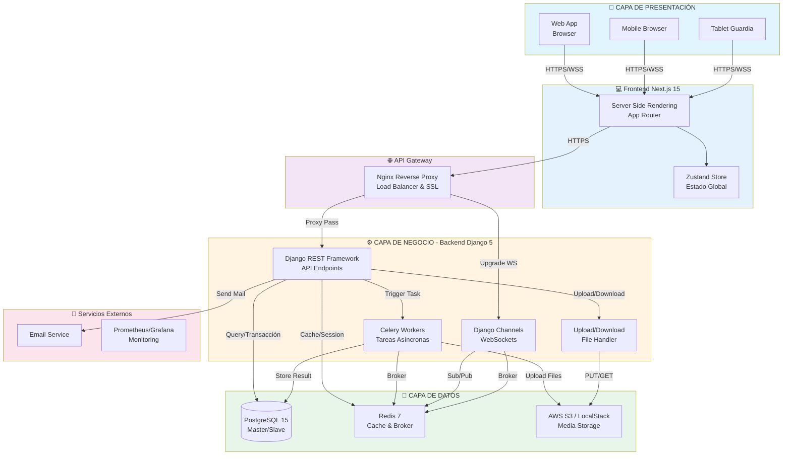
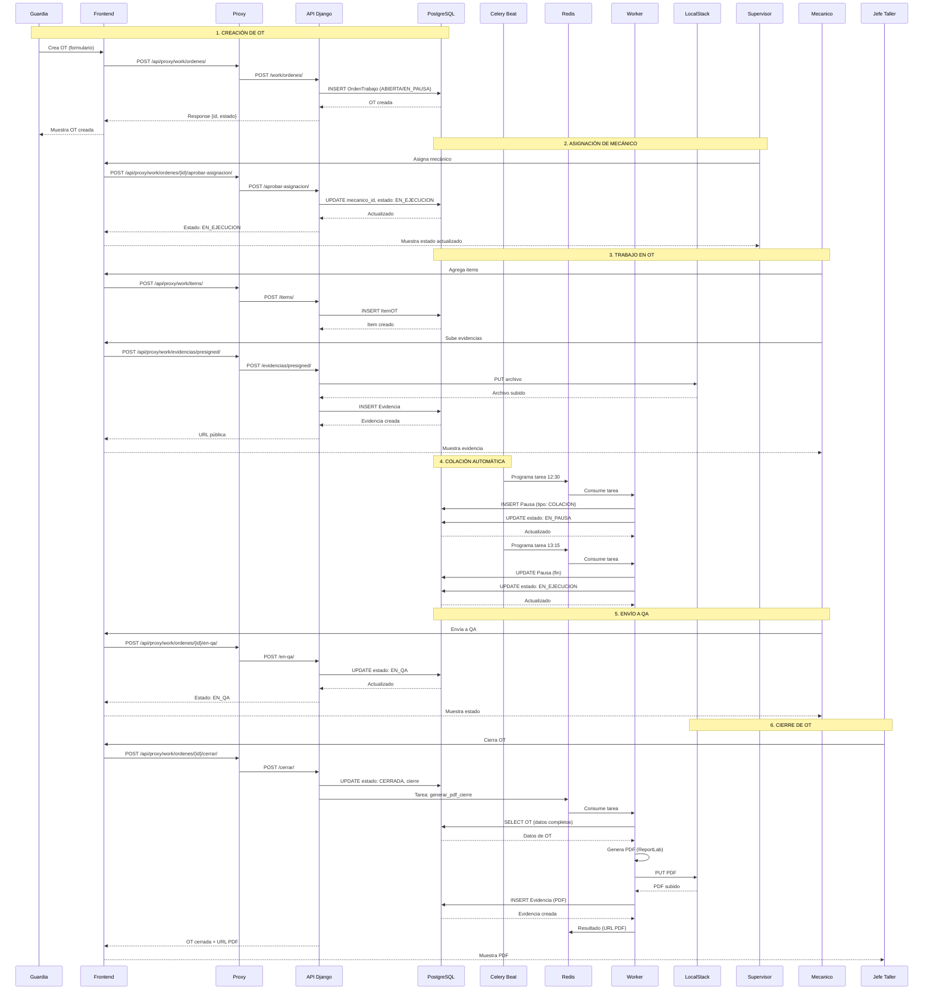
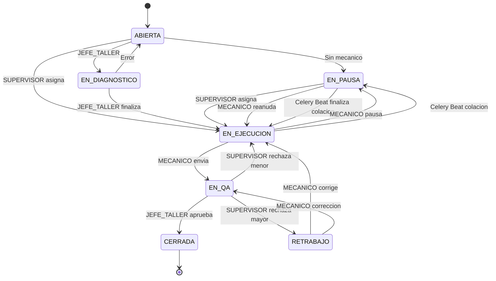

# Diagrama de Arquitectura Completo - Flujo de Trabajo OT

## Diagrama de Arquitectura con Flujo de Trabajo OT

## Diagrama de Flujo de Trabajo OT (3 Capas)

```mermaid
graph TB
    subgraph PRESENTACION["🎨 CAPA DE PRESENTACIÓN"]
        USUARIO_GUARDIA[👤 Guardia<br/>Crea OT]
        USUARIO_SUPER[👤 Supervisor<br/>Asigna Mecánico]
        USUARIO_MEC[👤 Mecánico<br/>Trabaja en OT]
        USUARIO_JEFE[👤 Jefe Taller<br/>Cierra OT]
    end
    
    subgraph FRONTEND["💻 Frontend Next.js"]
        FORM_CREATE[Formulario Crear OT<br/>/workorders/create]
        FORM_ASIGNAR[Formulario Asignar<br/>/workorders/id]
        FORM_TRABAJO[Formulario Trabajo<br/>/workorders/id]
        FORM_CIERRE[Formulario Cerrar<br/>/workorders/id/cerrar]
    end
    
    subgraph GATEWAY["🌐 API Gateway"]
        PROXY[Proxy Routes<br/>/api/proxy/work/]
    end
    
    subgraph NEGOCIO["⚙️ CAPA DE NEGOCIO"]
        API_CREATE[API: POST /work/ordenes/<br/>Crea OT ABIERTA/EN_PAUSA]
        API_ASIGNAR[API: POST /aprobar-asignacion/<br/>Transición a EN_EJECUCION]
        API_ITEMS[API: POST /items/<br/>Agrega Items]
        API_EVIDENCIAS[API: POST /evidencias/<br/>Sube Archivos]
        API_QA[API: POST /en-qa/<br/>Envía a QA]
        API_CERRAR[API: POST /cerrar/<br/>Cierra OT]
        
        CELERY_COLACION[Celery Beat<br/>Colación 12:30-13:15]
        CELERY_PDF[Celery Worker<br/>Genera PDF]
    end
    
    subgraph DATOS["💾 CAPA DE DATOS"]
        PG_OT[(PostgreSQL<br/>OrdenTrabajo)]
        PG_ITEMS[(PostgreSQL<br/>ItemOT)]
        PG_EVID[(PostgreSQL<br/>Evidencia)]
        PG_PAUSA[(PostgreSQL<br/>Pausa)]
        
        REDIS_TASK[Redis<br/>Broker Tareas]
        REDIS_CACHE[Redis<br/>Cache]
        
        S3_FILES[S3/LocalStack<br/>Archivos & PDFs]
    end
    
    %% Flujo 1: Creación de OT
    USUARIO_GUARDIA -->|1. Crea OT| FORM_CREATE
    FORM_CREATE -->|POST| PROXY
    PROXY -->|POST /work/ordenes/| API_CREATE
    API_CREATE -->|INSERT| PG_OT
    PG_OT -->|Response| API_CREATE
    API_CREATE -->|Response| FORM_CREATE
    FORM_CREATE -->|Muestra OT| USUARIO_GUARDIA
    
    %% Flujo 2: Asignación de Mecánico
    USUARIO_SUPER -->|2. Asigna Mecánico| FORM_ASIGNAR
    FORM_ASIGNAR -->|POST| PROXY
    PROXY -->|POST /aprobar-asignacion/| API_ASIGNAR
    API_ASIGNAR -->|UPDATE estado: EN_EJECUCION| PG_OT
    PG_OT -->|Response| API_ASIGNAR
    API_ASIGNAR -->|Notifica| CHANNELS_WS
    CHANNELS_WS -->|WebSocket| FORM_ASIGNAR
    
    %% Flujo 3: Trabajo en OT
    USUARIO_MEC -->|3. Agrega Items| FORM_TRABAJO
    FORM_TRABAJO -->|POST /items/| PROXY
    PROXY -->|POST| API_ITEMS
    API_ITEMS -->|INSERT| PG_ITEMS
    
    USUARIO_MEC -->|4. Sube Evidencias| FORM_TRABAJO
    FORM_TRABAJO -->|POST /evidencias/| PROXY
    PROXY -->|POST| API_EVIDENCIAS
    API_EVIDENCIAS -->|PUT archivo| S3_FILES
    API_EVIDENCIAS -->|INSERT| PG_EVID
    
    %% Flujo 4: Colación Automática
    CELERY_COLACION -->|12:30 Programa| REDIS_TASK
    REDIS_TASK -->|Consume| CELERY_COLACION
    CELERY_COLACION -->|INSERT Pausa| PG_PAUSA
    CELERY_COLACION -->|UPDATE EN_PAUSA| PG_OT
    
    CELERY_COLACION -->|13:15 Finaliza| REDIS_TASK
    REDIS_TASK -->|Consume| CELERY_COLACION
    CELERY_COLACION -->|UPDATE Pausa| PG_PAUSA
    CELERY_COLACION -->|UPDATE EN_EJECUCION| PG_OT
    
    %% Flujo 5: Envío a QA
    USUARIO_MEC -->|5. Envía a QA| FORM_TRABAJO
    FORM_TRABAJO -->|POST /en-qa/| PROXY
    PROXY -->|POST| API_QA
    API_QA -->|UPDATE EN_QA| PG_OT
    
    %% Flujo 6: Cierre de OT
    USUARIO_JEFE -->|6. Cierra OT| FORM_CIERRE
    FORM_CIERRE -->|POST /cerrar/| PROXY
    PROXY -->|POST| API_CERRAR
    API_CERRAR -->|UPDATE CERRADA| PG_OT
    API_CERRAR -->|Tarea PDF| REDIS_TASK
    REDIS_TASK -->|Consume| CELERY_PDF
    CELERY_PDF -->|SELECT datos| PG_OT
    CELERY_PDF -->|Genera PDF| CELERY_PDF
    CELERY_PDF -->|PUT PDF| S3_FILES
    CELERY_PDF -->|INSERT Evidencia| PG_EVID
    
    %% WebSocket para notificaciones
    CHANNELS_WS[Django Channels<br/>WebSocket]
    CHANNELS_WS -->|Sub/Pub| REDIS_CACHE
    CHANNELS_WS -->|Notifica cambios| FORM_ASIGNAR
    CHANNELS_WS -->|Notifica cambios| FORM_TRABAJO
    
    %% Estilos
    style PRESENTACION fill:#e1f5ff
    style FRONTEND fill:#e3f2fd
    style GATEWAY fill:#f3e5f5
    style NEGOCIO fill:#fff4e1
    style DATOS fill:#e8f5e9
```

## Diagrama Detallado de Flujo OT (Paso a Paso)

## Diagrama de Estados con Roles

## Componentes por Capa

### 🎨 Capa de Presentación
- **Web App**: Navegador web estándar
- **Mobile Browser**: Navegadores móviles
- **Tablet Guardia**: Tablets para guardias en terreno

### 💻 Frontend
- **Next.js 15**: Framework React con SSR
- **App Router**: Sistema de rutas de Next.js
- **Zustand Store**: Gestión de estado global

### 🌐 API Gateway
- **Nginx**: Reverse proxy, load balancer y SSL termination

### ⚙️ Capa de Negocio
- **Django REST Framework**: API REST principal
- **Celery Workers**: Tareas asíncronas (PDFs, colación)
- **Celery Beat**: Programador de tareas periódicas
- **Django Channels**: WebSockets para notificaciones en tiempo real
- **Upload/Download Handler**: Gestión de archivos

### 💾 Capa de Datos
- **PostgreSQL 15**: Base de datos principal (Master/Slave)
- **Redis 7**: Cache y broker de mensajes
- **AWS S3 / LocalStack**: Almacenamiento de archivos

### 🔌 Servicios Externos
- **Email Service**: Envío de correos
- **Prometheus/Grafana**: Monitoreo y métricas

