# Diagramas Mermaid - Solo Código

Copia solo el código dentro de los bloques ```mermaid para usar en Mermaid Live Editor o cualquier herramienta compatible.

---

## Diagrama 1: Completo (3 Capas)

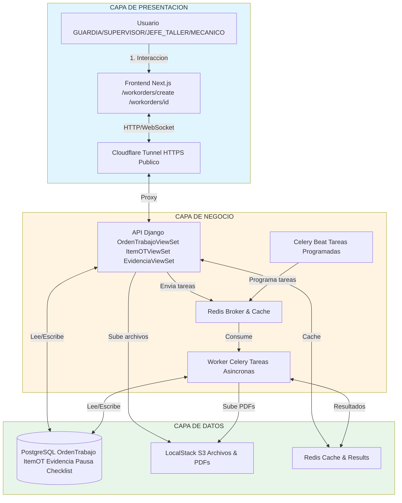

---

## Diagrama 2: Estados

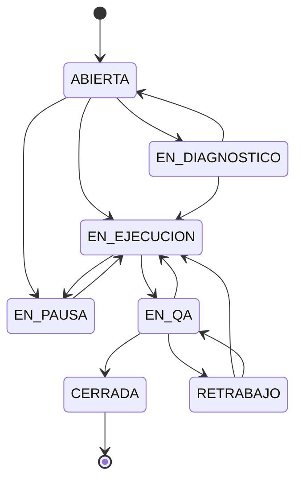

---

## Diagrama 3: Secuencia

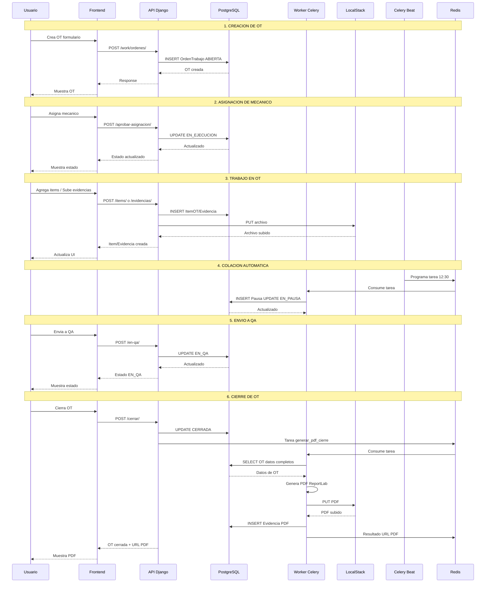

---

## Diagrama 4: Componentes por Capa

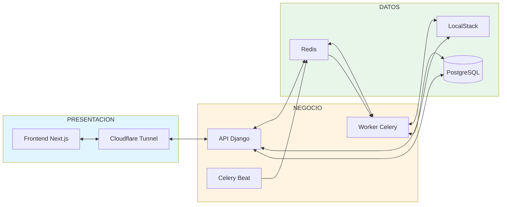

---

## Diagrama 5: Flujo Creación OT

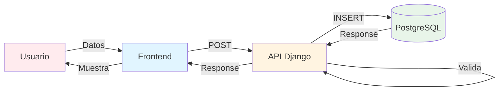

---

## Diagrama 6: Flujo Subida Evidencia

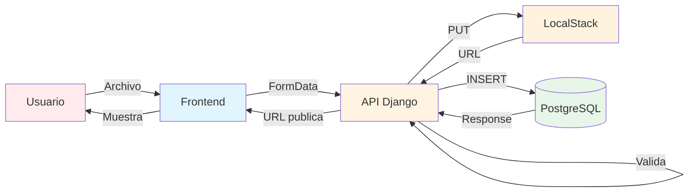

---

## Diagrama 7: Flujo Generación PDF

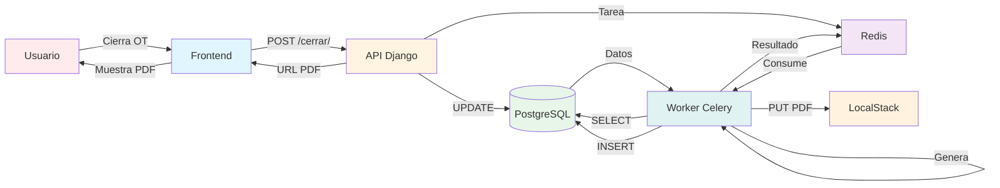

---

## Diagrama 8: Arquitectura Completa

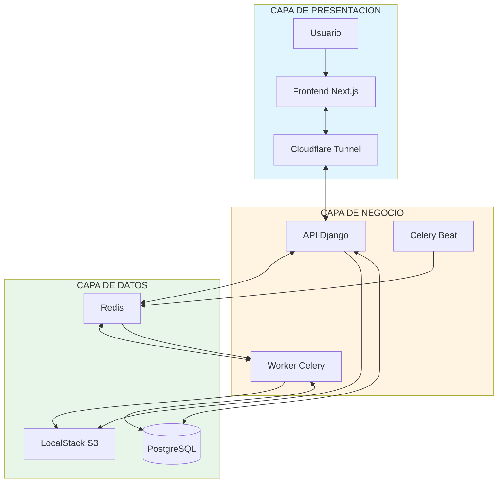

---

## Diagrama 9: Arquitectura Sistema Completo

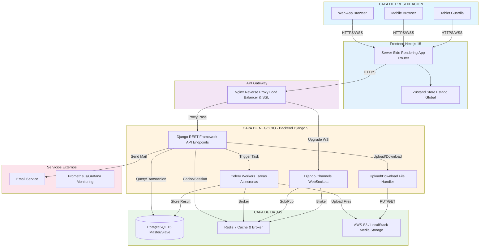

---

## Diagrama 10: Flujo Trabajo OT Completo

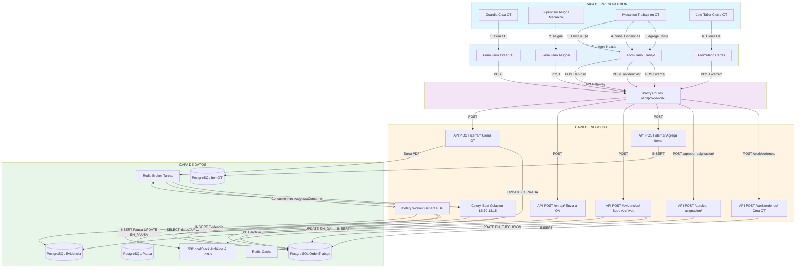

---

## Diagrama 11: Arquitectura Completa Mejorada (Con Capa de Negocio)

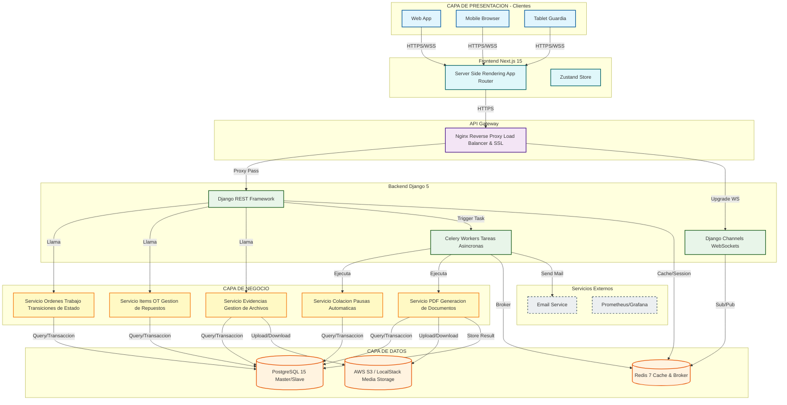

